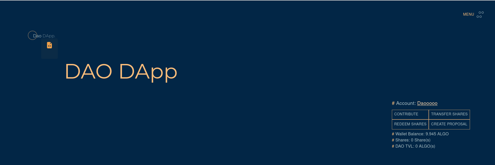
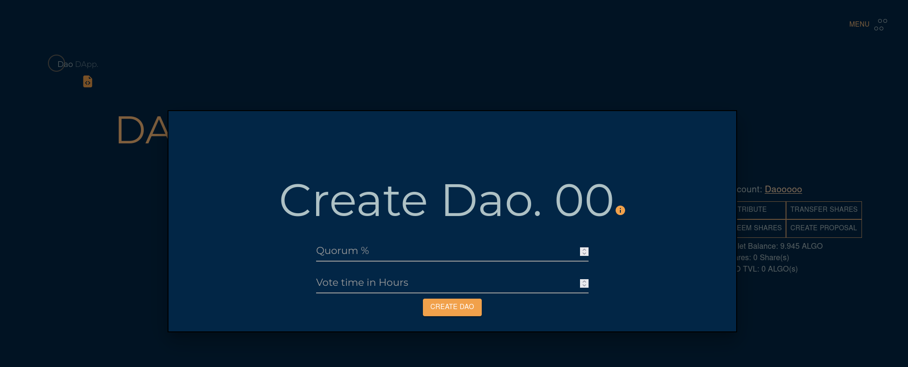

# DAO-DAPP
The app is hosted here: [https://blisado1.github.io/ALGO-DAO-DApp/](https://blisado1.github.io/ALGO-DAO-DApp/)

# Disclaimer
This is a test dapp and should not be used in production.

This DAO contract:

- Collects investors money (ALGO) & allocate shares
- Keep track of investor contributions with shares
- Allow investors to transfer shares only between investors 
- Allow investment proposals to be created and voted
- Execute successful investment proposals (i.e send money)
- The number of votes an investor has is equivalent to the number of shares the investor has.

On deployment the contract has been set to 70 % approval and 6 mins for voting due to users wishing to test the dapp immediately.

### Contract Info
This DApp is run by two contracts, the DAO contract [here](https://github.com/Blisado1/ALGO-DAO-DApp/blob/main/src/contracts/dao_contract.py) and the Proposal contract (here)[https://github.com/Blisado1/ALGO-DAO-DApp/blob/main/src/contracts/proposal_contract.py].
- Creating a proposal means, creating a new proposal contract, and the creator of contract, has to explicitly lock in the proposal amount in the DAO after creating the contrract before voting for that proposal can be done
- Various checks are in place to ensure that a proposal can only be approved from the DAO contract appID, it was created with. If the Dao contract appID is changed, any action on proposal will fail.
- Investors cannot create proposal with amounts that are more than the free funds in the the DAO contract. (free-funds = available_funds - locked_funds)
- Transferring of shares will only succeed, if the receiver is already an investor (i.e. an account that has opted in to the DAO contract)
- Redeeming of shares will only succeed, if the free funds in the contract is more than or equal to the shares to be redeemed.

<!-- GETTING STARTED -->

## :point_down: Getting Started

### Prerequisites

- [Node.js](https://nodejs.org/en/) v16.xx.x

### Run locally

1. Clone repo
   ```sh
   git clone https://github.com/dacadeorg/algorand-react-marketplace.git
   ```

2. Install packages
   ```sh
   npm install
   ```
3. Run application
   ```sh
   npm start
   ```
4. Open development server on http://localhost:3000

<p align="right">(<a href="#top">back to top</a>)</p>


## :computer: Development: Connect to testnet wallet
- Create account on testnet using [MyAlgo Wallet](https://wallet.myalgo.com/)
- Add funds using [faucet](https://bank.testnet.algorand.network/)
- Start app, click "Connect Wallet" and use MyAlgo Wallet UI to connect testnet wallet


<p align="right">(<a href="#top">back to top</a>)</p>


<!-- CONTRIBUTING -->

## :writing_hand: Contributing

Contributions are what make the open source community such an amazing place to learn, inspire, and create. Any
contributions you make are **greatly appreciated**.

If you have a suggestion that would make this better, please fork the repo and create a pull request. You can also
simply open an issue with the tag "enhancement". Don't forget to give the project a star! Thanks again!

1. Fork the Project
2. Create your Feature Branch (`git checkout -b feature/AmazingFeature`)
3. Commit your Changes (`git commit -m 'Add some AmazingFeature'`)
4. Push to the Branch (`git push origin feature/AmazingFeature`)
5. Open a Pull Request


## Development
### Creating a new DAO contract
- A new DAO contract can be created only in development, replace the value of the `daoAppId` in the constants.js [file](https://github.com/Blisado1/ALGO-DAO-DApp/blob/main/src/utils/constants.js#L59) with 0 and a file icon should appear under the daoDapp logo and on clicking that a form for creating a new dao should appear.





- After completing the form, open the console and copy the appId outputed and save it as the value of the `daoAppId`.

NOTE: You'll also need to edit the proposals.py file [here](https://github.com/Blisado1/ALGO-DAO-DApp/blob/2f2ed46b4f4e60b98c9919429bd3fddd4660c0d8/src/contracts/proposal_contract.py#L41) or the proposal_approval.teal file [here](https://github.com/Blisado1/ALGO-DAO-DApp/blob/main/src/contracts/proposal_approval.teal#L411) to contain the new value of the dao app ID.


<p align="right">(<a href="#top">back to top</a>)</p>


<!-- LICENSE -->

## :policeman: License

Distributed under the MIT License. See `LICENSE.txt` for more information.

<p align="right">(<a href="#top">back to top</a>)</p>


